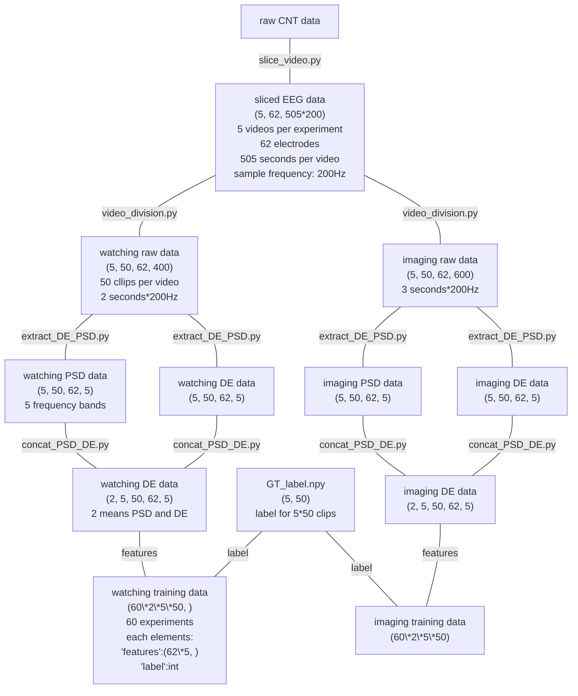

```mermaid
graph TD
	A["raw CNT data"]
	B["sliced EEG data<br>(5, 62, 505*200)"<br>5 videos per experiment<br>62 electrodes<br> 505 seconds per video<br>sample frequency: 200Hz]
	C["watching raw data<br>(5, 50, 62, 400)<br>50 cllips per video<br>2 seconds*200Hz"]
	D["imaging raw data<br>(5, 50, 62, 600)<br>3 seconds*200Hz"]
	E["watching PSD data<br>(5, 50, 62, 5)<br>5 frequency bands"]
	F["watching DE data<br>(5, 50, 62, 5)"]
	G["imaging PSD data<br>(5, 50, 62, 5)"]
	H["imaging DE data<br>(5, 50, 62, 5)"]
	I["watching DE data<br>(2, 5, 50, 62, 5)<br>2 means PSD and DE"]
	K["GT_label.npy<br>(5, 50)<br>label for 5*50 clips"]
	J["imaging DE data<br>(2, 5, 50, 62, 5)"]
	L["watching training data<br>(60\*2\*5\*50, )<br>60 experiments<br>each elements:<br>'features':(62\*5, )<br>'label':int"]
	M["imaging training data<br>(60\*2\*5\*50)"]
	A---|slice_video.py|B
	B---|video_division.py|C
	B---|video_division.py|D
	C---|extract_DE_PSD.py|E
	C---|extract_DE_PSD.py|F
	D---|extract_DE_PSD.py|G
	D---|extract_DE_PSD.py|H
	E---|concat_PSD_DE.py|I
	F---|concat_PSD_DE.py|I
	G---|concat_PSD_DE.py|J
	H---|concat_PSD_DE.py|J
	I---|features|L
	J---|features|M
	K---|label|L
	K---|label|M
	
```

